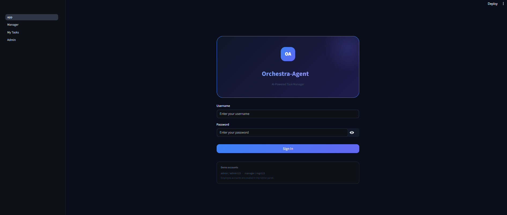
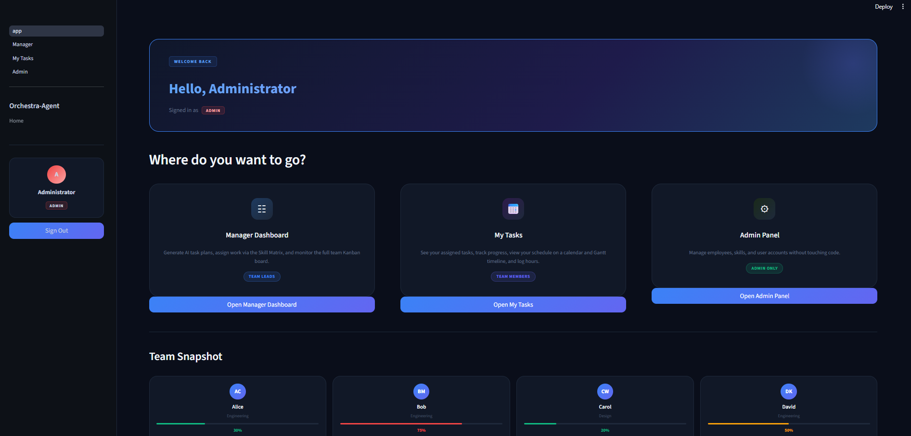
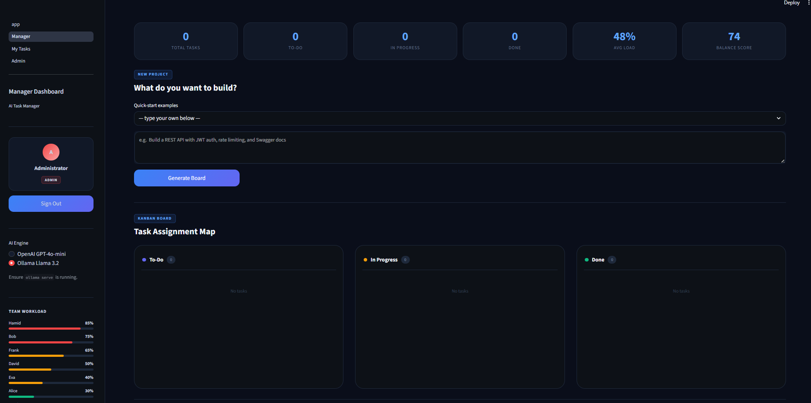
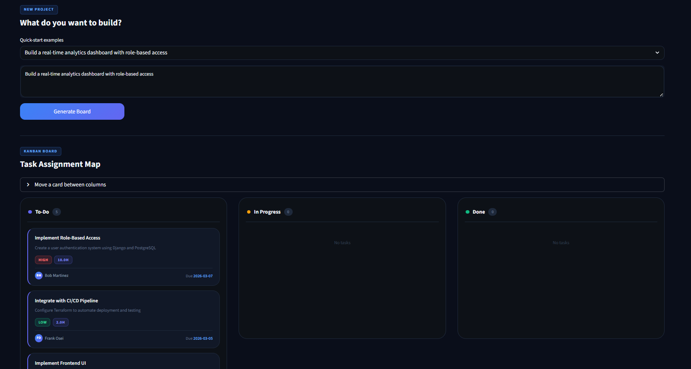
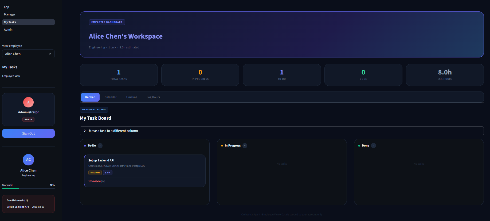
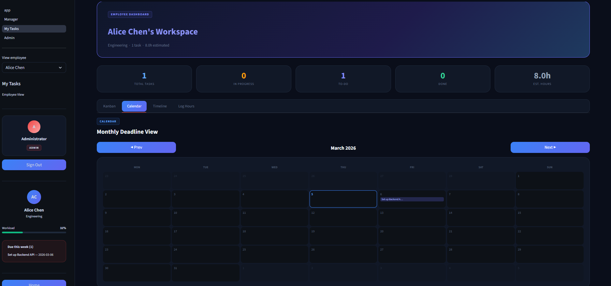
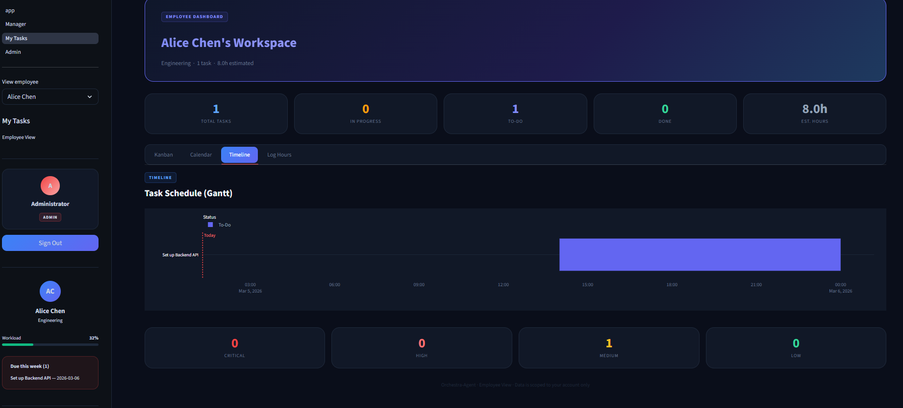
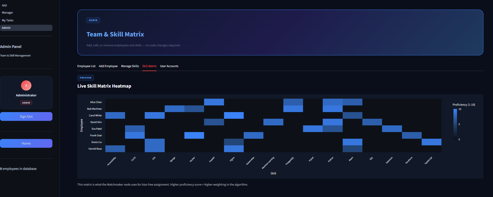

---
title: Orchestra-Agent
emoji: 🎼
colorFrom: blue
colorTo: indigo
sdk: streamlit
sdk_version: 1.38.0
app_file: app.py
pinned: false
license: mit
short_description: AI-powered task manager — plain English to assigned Kanban board
---

# 🎼 Orchestra-Agent

> AI-powered task management system — from a single sentence to a fully assigned, scheduled team board.





---

## ✨ Features

| Feature | Description |
|---|---|
| 🤖 **AI Task Planning** | Type a goal in plain English → 4-node LangGraph pipeline decomposes it into sub-tasks with priorities and deadlines |
| ⚖️ **Bias-free Assignment** | Skill Matrix × Workload scoring — assigns each task to the best-fit person algorithmically |
| 🔐 **Role-based Login** | `admin` / `manager` / `employee` — scoped views, no one sees data they shouldn't |
| 📋 **Manager Kanban** | Full Kanban board with move-card controls and workload analytics |
| 📅 **Employee Portal** | Personal Kanban + monthly calendar + Gantt timeline + hour logging |
| ⚙️ **Admin CRUD** | Manage employees, skills, and user accounts through the web UI — no code changes ever |
| 🐳 **Production-ready** | Docker + RAM limits + Loguru rotating logs + FastAPI `/health` endpoint |

---

## 🖼️ Screenshots

### Manager Dashboard — AI Kanban Board


### AI Task Generation


### Employee View — My task


### Employee View — Calendar


### Employee View — Timeline


### Admin Panel — Skill Matrix


---

## 🏗️ Architecture

```
┌──────────────────────────────────────────────────────────┐
│                     Streamlit UI                         │
│  app.py · 1_Manager · 2_My_Tasks · 3_Admin               │
└─────────────────────────┬────────────────────────────────┘
                          │ POST /orchestrate
┌─────────────────────────▼────────────────────────────────┐
│                   FastAPI Backend                        │
│                                                          │
│  ┌──────────┐  ┌─────────────┐  ┌──────────┐  ┌──────┐  │
│  │ Planner  │→ │  Matchmaker │→ │Scheduler │→ │Report│  │
│  │ (LLM)    │  │(Skill×Load) │  │(Deadline)│  │(JSON)│  │
│  └──────────┘  └─────────────┘  └──────────┘  └──────┘  │
└─────────────────────────┬────────────────────────────────┘
                          │
┌─────────────────────────▼────────────────────────────────┐
│             SQLite  (orchestra.db)                       │
│         employees · skills · tasks · users               │
└──────────────────────────────────────────────────────────┘
```

---

## 🚀 Quick Start

### Prerequisites
- Python 3.11+
- OpenAI API key **or** [Ollama](https://ollama.com) installed locally (free)

### 1 — Clone & install

```bash
git clone https://github.com/Punyisa-m/Orchestra-Agent.git
cd orchestra-agent

python -m venv .venv
# Windows
.venv\Scripts\activate
# Mac / Linux
source .venv/bin/activate

pip install -r requirements.txt
```

### 2 — Configure

```bash
cp .env.example .env
# Edit .env — add OPENAI_API_KEY or leave blank to use Ollama
```

### 3 — Run

```bash
streamlit run app.py
# → http://localhost:8501
```

### Default accounts

| Username | Password | Role |
|---|---|---|
| `admin` | `admin123` | Full access |
| `manager` | `mgr123` | Manager + My Tasks |

> ⚠️ **Change these passwords immediately** via Admin → User Accounts after first login.

Employee accounts are created in the Admin panel and must be linked to an employee record.

---

## 🐳 Docker

```bash
mkdir -p data logs
docker compose up -d

# Verify health
curl http://localhost:8000/health

# Live resource monitoring
docker stats orchestra_api orchestra_ui
```

RAM allocation on an 8 GB machine:

| Container | Hard limit | Role |
|---|---|---|
| `orchestra_api` | 900 MB | FastAPI + LangGraph |
| `orchestra_ui` | 400 MB | Streamlit UI |
| OS + Docker overhead | ~1 GB | — |
| **Free headroom** | **~5.7 GB** | Ollama / other apps |

---

## 📁 Project Structure

```
orchestra-agent/
├── app.py                  # Login gate + Home hub
├── auth.py                 # PBKDF2 hashing · session · role guards
├── database.py             # SQLite layer: schema, CRUD, generators
├── graph.py                # LangGraph 4-node AI pipeline
├── requirements.txt
├── Dockerfile              # Two-stage python:3.11-slim (~300 MB image)
├── docker-compose.yml      # RAM-limited services
├── .env.example
├── .streamlit/
│   └── config.toml         # Dark theme
├── api/
│   └── main.py             # FastAPI: /orchestrate · /health · Loguru
└── pages/
    ├── 1_Manager.py        # Manager Dashboard
    ├── 2_My_Tasks.py       # Employee Portal
    └── 3_Admin.py          # Admin CRUD
```

---

## 🤖 AI Pipeline Detail

```
Input: "Build a login system with JWT auth"
  ↓
Planner     → GPT-4o-mini / Llama 3.2
              Decomposes into 3–7 sub-tasks
              Assigns priority + difficulty + estimated hours
  ↓
Matchmaker  → Skill Matrix × Workload algorithm
              Scores every employee for each task
              Assigns best-fit person (bias-free)
  ↓
Scheduler   → Calculates deadlines from estimated hours
              Writes tasks to SQLite
  ↓
Reporter    → Returns structured JSON to UI
```

Dual LLM support: **OpenAI GPT-4o-mini** (cloud) or **Ollama Llama 3.2** (local, free, ~2 GB RAM).

---

## 🔐 Security

- PBKDF2-SHA256 · 310,000 iterations · per-user random salt (NIST SP 800-132)
- Constant-time comparison — prevents timing attacks
- Role-guard on every page — unauthorized requests redirect to login
- Zero external auth libraries — Python stdlib `hashlib` / `hmac` / `secrets` only

---

## 🔧 Tech Stack

| Layer | Technology |
|---|---|
| AI / Orchestration | LangGraph · LangChain · OpenAI API / Ollama |
| Backend API | FastAPI · Uvicorn |
| Frontend | Streamlit (multi-page) |
| Database | SQLite (WAL mode · batch generators) |
| Data Validation | Pydantic v2 |
| Visualization | Plotly (Gantt · heatmap · bar) |
| Logging | Loguru (rotating 10 MB/file) |
| Auth | Python stdlib (PBKDF2-SHA256) |
| Container | Docker · python:3.11-slim two-stage |

---

## 🌐 Free Deployment

### Streamlit Community Cloud (easiest)
```
1. Push to public GitHub repo
2. share.streamlit.io → New app → set Main file: app.py
3. Settings → Secrets → OPENAI_API_KEY = "sk-..."
4. Deploy — get a free HTTPS URL in ~3 min
```

### Hugging Face Spaces (16 GB RAM — recommended)
```
1. New Space → SDK: Streamlit
2. Add to README header: sdk: streamlit, app_file: app.py
3. git push → auto-deploys
4. Settings → Secrets → add OPENAI_API_KEY
```

---

## 📄 License

MIT — see [LICENSE](LICENSE)

---

<div align="center">
Built with LangGraph · FastAPI · Streamlit · SQLite
</div>